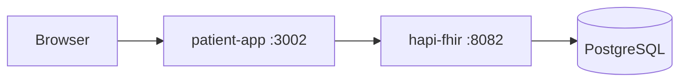
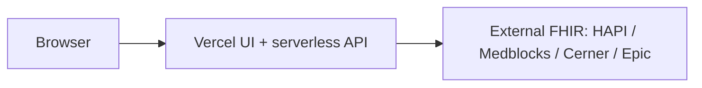

# Deployment Guide

Local development (Docker / Express) and production on Vercel.

**Live app:** https://fhir-patient-app-five.vercel.app

- Vercel env and SMART: [vercel_readme.md](./vercel_readme.md)
- QA checklists: [TESTING.md](./TESTING.md)

## Architecture

### Local (Docker Compose)



### Production (Vercel)



| Component | Where | Notes |
|-----------|-------|--------|
| UI + `/api/*` | Vercel | Static React + serverless proxy / SMART |
| FHIR servers | External | Chosen in the header source selector |
| Local HAPI | Docker only | Seeded demos; not used on Vercel |

## Local development

### App on host, HAPI in Docker

```bash
npm install && npm install --prefix client && npm install --prefix server
cp .env.example .env
npm run fhir:up
npm run seed:clinical
npm run dev
```

UI at http://localhost:5173, API at http://localhost:3001.

### Full stack in Docker

```bash
npm run docker:up
npm run seed:clinical
```

App at http://localhost:3002.
Rebuild after code changes:

```bash
docker compose up -d --build patient-app
```

#### Docker FHIR wait (`config/fhir.json`)

`FHIR_CONFIG_PATH` / `config/fhir.json` is used only by the container **entrypoint** to wait for a `/metadata` URL before starting Express.
It does **not** repoint the multi-source proxy at runtime.
Runtime routing uses env vars such as `HAPI_FHIR_BASE_URL`, `FHIR_BASE_URL` (Medblocks), and Cerner/Epic SMART settings (see [.env.example](./.env.example)).

Set `FHIR_WAIT=false` on `patient-app` if you do not want startup to block on FHIR readiness.

## Production - Vercel

1. Import the GitHub repo in the [Vercel dashboard](https://vercel.com/dashboard).
2. Build settings come from [vercel.json](./vercel.json).
3. Set Production env vars as documented in [vercel_readme.md](./vercel_readme.md).
4. Deploy (Git pushes redeploy the connected branch).

CLI:

```bash
npm run deploy:vercel
```

### Do not set on Vercel

| Variable | Why |
|----------|-----|
| `FHIR_CONFIG_PATH` | No file mounts |
| `FHIR_WAIT` | Docker/Express only |
| `PORT` | Injected by Vercel |
| `VITE_API_BASE` | Same-origin `/api` |

## Troubleshooting

| Symptom | Fix |
|---------|-----|
| Empty list on Vercel | Finish SMART sign-in or check source credentials ([TESTING.md](./TESTING.md)) |
| Local Docker hangs at start | Wait for HAPI, or set `FHIR_WAIT=false` |
| Env change ignored on Vercel | Redeploy production |

More SMART rows: [vercel_readme.md](./vercel_readme.md#troubleshooting).

## Related files

| File | Purpose |
|------|---------|
| [vercel.json](./vercel.json) | Build, SPA rewrites, function timeouts |
| [api/](./api/) | Serverless handlers |
| [Dockerfile](./Dockerfile) | Local `patient-app` image |
| [docker-compose.yml](./docker-compose.yml) | App + HAPI + Postgres |
